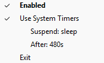

<!---
# cspell: ignore venv sleeperservice Elgato pystray pydantic pycaw  Popen pyinstaller
# cspell: ignore Voicemeeter pypi appxpackage appsfolder startapps requestsoverride
---> 

# sleeper_service

This  is a minimal Windows tray utility that enables (forces) sleep based on the active
power plan "Sleep After" parameter. 

For a long rant on why this exists, see the [Package Rationale](#package-rationale). 

For the short version of why this exists, if you are looking for something/anything
that deals with the "Legacy Kernel Caller" blocking sleep problem, hopefully this will
work for you. In particular, if you have issues with Elgato Wave Link killing sleep, 
this is intended to help.

The v0.9 release provides a tray utility to trigger sleep or hibernate.

Wave Link 3.0 is currently in beta and there are some people (myself included) who are
having problems with Wave Link 3.0 resuming from sleep properly. I'm hoping that Elgato
will address this in the beta, but if not, I have a possible work around that I will
implement post 3.0 full release.

# Change Log

- **v0.9.0** Tray manager interface, core sleep functions implemented.
- **v0.0.2** Functional beta. Still requires pystray wrapper. 
- **v0.0.1** Proof of concept. 

# Installation and Usage

sleeper_service is a system tray application for Windows. I'd recommend downloading the
zip file from the [Release](https://github.com/BuongiornoTexas/sleeper_service/releases)
page, unzipping and adding the executable to your start programs. However, if you
prefer, you can install via pip (`pip install sleeper_service`) and either create your
own pyinstaller bundle or run it from a local python installation or virtual
environment.

Right click on the sleeper_service icon to see the interface:

  

Clicking on `Enabled` will enable/disable the service. You can also enable/disable by
left clicking on the sleeper_service icon. The icon will have a red cross when disabled.

You can also switch between using the system timers and a manual timer specification. 
The `Suspend:` and `After:` lines are information only to tell you what the suspend
action is and when it will be triggered.

There are a few other configuration parameters, but these only be changed by editing the
[configuration file](#configuration-file) - exit the service before editing. 

(I'm assuming most of the parameters will be changed infrequently, so not worth 
including in the tray interface - Please raise an issue if you would prefer more
parameters in the UI.)

# Configuration file

The `config.toml` file provides manual configuration for sleeper_service. The location
of the file is determined in the following priority order.
- If the command line option `--config <file path>` specifies a file, e service will use
the named file.
- If the command line option `--config <folder path>` specifies a folder, the service
will look for `config.toml` in the specified folder path.
- If the service is run from the pyinstaller bundle, it will look for `config.toml` in
the same folder as the service executable.
- If the service is run as a normal python routine, it will look for the fi`config.toml`
in the current working directory.

If the file does not exist, it will be created. 

The configuration file options are:

- `enabled`: `true` or `false`. Enable or disable the sleeper service. Switchable from
the system tray interface. Useful if you want to turn it off for a while.
- `user_system_timer`: `true` or `false`. If `true`, the suspend timer and suspend state
are read from the users Windows Power plan (`Sleep after` and `Hibernate after` values,
with the shorter timer assumed to apply). If `false`, manually specified values are
taken from the configuration file. . Switchable from the system tray interface.
- `manual_suspend_after`: time in minutes to activate suspend if `use_system_timer` is 
`false`.
- `manual_suspend_state`: The suspend state to apply if `use_system_timer` is `false`. 
Allowable case sensitive values are: "sleep", "hibernate" or "disabled".
- `check_interval`: time in minutes that sleeper_service will sleep between checks that
the idle time has expired (I'm assuming most people will be happy checking once a
minute at most).

The default configuration file is:
```
enabled = true
use_system_timer = true
manual_suspend_after = 10
manual_suspend_state = "sleep"
check_interval = 1
```

# Package Rationale

This utility deals with the brain dead Windows implementation that allows an audio
stream to block sleep. (Truly. It's genuinely stupid.)

Typical symptoms of this problem are:
- A call to powercfg /requests will include the lines:
  ```
  [SYSTEM]
  An audio stream is currently in use.
  [DRIVER] Legacy Kernel Caller
  ```
- Windows ignores sleep settings in the power plan (yeah, it's really this stupid).
- There are no easy fixes or overrides to address the problem.

I've run into this problem with Elgato's Wave Link software (which is the trigger for
writing this utility), and it has been a problem with Voicemeeter in the past (not sure
if this has been resolved in more recent versions), and plenty of other software that
creates an audio stream. 

A quick search brings a vast range of complaints about Microsoft's bone headed
implementation, but little in the way of effective, simple solutions to the problem. In
particular:
- Using `powercfg /requestsoverride` should allow users to prevent the `Legacy Kernel 
Caller` from blocking sleep. This flat out doesn't work. (Even if it did, Microsoft has
decreed that this particular powercfg call requires elevated privileges. For a user
space problem. Did I mention bone headed?).
- There are various solutions using AutoHotKey, Visual Basic Scripts, and the Windows
task manager. All are a bit opaque. 

So this is yet another solution to the problem which is hopefully be relatively
fire and forget, and also easy to suspend for the times you actually do want an
audio stream to block sleep (rarely in my experience).

# Development/testing

This section is a collection of information that may be useful in developing/testing
future functionality.

## Powercfg Options

Some of these commands may require an elevated shell:

- `powercfg /hibernate on/off` to enable or disable hibernate.
- `powercfg /a` lists available sleep states for system (and also sleep states that are
not available/enabled).

## Sleep and Requests

Forcing sleep from the Windows menu or programmatically will clear sleep blocking
requests (`powercfg /requests`). Restarting audio streams seems to repair this when
required, so I'm not going to worry about this. (Ideally, Microsoft would fix the
underlying problem that audio streams should not have special privileges that block
sleep states).

# PyInstaller Builds

If you are building your own binary, I suggest starting with a clean environment and
install only  sleeper_service and pyinstaller to minimise bycatch in the pyinstaller
bundle.

# TODO

Implementation:
- Update module docs as development progresses.
- Maybe add option too keep awake if audio stream detected on specific devices.
- Sort out active/inactive icons.
- Kill the console and convert to .pyw app.

Right now, wave link breaks things badly on resume from sleep. If Elgato don't fix
this, each time we resume, we may need to:
- (best case) restart wave link.
- check if wave link is active, kill and restart.

For finding and restarting Wave Link:
  - Can get more info with get-appxpackage -Name Elgato.Wavelink and get-startapps
  - If the final release doesn't fix problems in the beta, may need to kill the 
  wave link process and restart - kill+psutils or taskkill?
  - Finally, restart wave link with either qualified app name. 
    subprocess.run("explorer shell:appsfolder\\Elgato.WaveLink_g54w8ztgkx496!App")
  - Or, even better: Wave Link has an app execution alias: "Elgato.WaveLink.exe", so
  no need to find UWP name if this is active!
    - So far, it looks like the easiest method to start this is with:
    ```subprocess.Popen("Elgato.Wavelink.exe")```

Other:
- Look into using pycaw to enable/disable microphones/inputs as a way to kill 
sleep blocking by powercfg requests. Specifically, using privacy & security setting for
microphone. Maybe disabling device works as well. Neither sound like good solutions
though.
